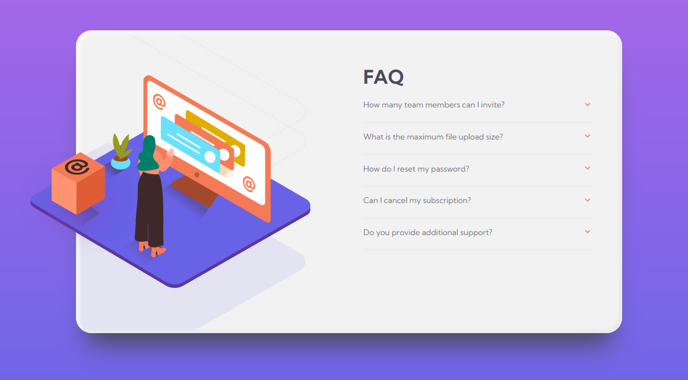

# Frontend Mentor - FAQ accordion card solution

This is a solution to the [FAQ accordion card challenge on Frontend Mentor](https://www.frontendmentor.io/challenges/faq-accordion-card-XlyjD0Oam). Frontend Mentor challenges help you improve your coding skills by building realistic projects. 

## Table of contents

- [Overview](#overview)
  - [The challenge](#the-challenge)
  - [Screenshot](#screenshot)
  - [Links](#links)
- [My process](#my-process)
  - [Built with](#built-with)
  - [What I learned](#what-i-learned)
  - [Continued development](#continued-development)
  - [Useful resources](#useful-resources)
- [Author](#author)
- [Acknowledgments](#acknowledgments)

**Note: Delete this note and update the table of contents based on what sections you keep.**

## Overview

### The challenge

Users should be able to:

- View the optimal layout for the component depending on their device's screen size
- See hover states for all interactive elements on the page
- Hide/Show the answer to a question when the question is clicked

### Screenshot



### Links

- Solution URL: [GitHub faq-accordion-card-main](https://github.com/terremotoBCN/faq-accordion-card-main)
- Live Site URL: [Add live site URL here](https://your-live-site-url.com)

## My process

### Built with

- Semantic HTML5 markup
- CSS custom properties
- Powered by Sass/SCSS
- Flexbox Layouts
- Mobile-first workflow

___
### What I learned

Use this section to recap over some of your major learnings while working through this project. Writing these out and providing code samples of areas you want to highlight is a great way to reinforce your own knowledge.

To see how you can add code snippets, see below:

```html
<article  rticle id="article__01" class="faq__article" tabindex="1" accesskey="1" accessKeyLabel="$">
  <h2 class="faq__article-title">How many team members can I invite?</h2>
    <div class="faq__article-answer">
      <p>You can invite up to 2 additional users on the Free plan. There is no limit on team members for the Premium plan.</p>
    </div>
</article>
```
#### CSS
I use Sass variables in conjunction with CSS variables to work with the best of both worlds.

I need to use [Breaking Change: CSS Variable Syntax](https://sass-lang.com/documentation/breaking-changes/css-vars)
```css
/* SCSS*/
	/***	Colors	***/
	$dark-blue: hsl(238, 29%, 16%);
	$soft-red: hsl(14, 88%, 65%);
	$soft-violet: hsl(273, 75%, 66%);
	$soft-blue: hsl(240, 73%, 65%);


/* CSS */
:root{
  	/***	Colors	***/
	--dark-blue: 	#{$dark-blue};
	--soft-red:		#{$soft-red};
	--soft-violet: 	#{$soft-violet};
	--soft-blue: 	#{$soft-blue};

}
```
#### JS
With this attribute, [`Elemet.scrollHeight`](https://developer.mozilla.org/es/docs/Web/API/Element/scrollHeight) we achieve the animation to collapse the answers.

TX 2 [ Bedimcode ]( https://www.youtube.com/watch?v=-ZblPRBjJJw )

```js
53. articleAnswer[0].style.height = `${articleAnswer[0].scrollHeight}px`;
```

___
### Continued development

Use this section to outline areas that you want to continue focusing on in future projects. These could be concepts you're still not completely comfortable with or techniques you found useful that you want to refine and perfect.

**Note: Delete this note and the content within this section and replace with your own plans for continued development.**

### Useful resources

- [Responsive Accordion](https://youtu.be/-ZblPRBjJJw) - This video has helped me to prepare the project to use Sass / SCSS and how to create the accordion behavior to display the responses.

___

## Author

- Website - [terremotoBCN](https://github.com/terremotoBCN)
- Frontend Mentor - [@terremotoBCN](https://www.frontendmentor.io/profile/terremotoBCN)
- Twitter - [@terremotoBCN](https://www.twitter.com/terremotoBCN)

